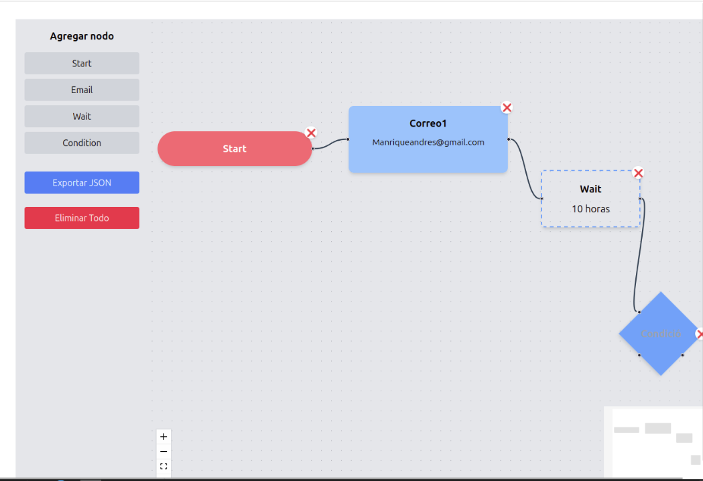

# 🚀 PRUEBA TÉCNICA: WORKFLOW AUTOMATION BUILDER

## 🎯 Objetivo

Construir un editor visual tipo "Workflow Automation" donde el usuario pueda:
- Añadir nodos de distintos tipos (Start, Email, Wait, Condition).
- Conectarlos entre sí para definir una secuencia de acciones.
- Editar el contenido de cada nodo de manera inline.
- Ver los datos exportados en formato JSON reflejando el flujo actual.
- Cambiar entre modo Claro y Oscuro dinámicamente.

---

## 🛠 Tecnologías utilizadas

- React
- Vite
- TypeScript
- TailwindCSS
- React Flow

---

## ✅ Funcionalidades implementadas

- **Añadir nodos**: Start, Email, Wait, Condition.
- **Edición inline** del contenido de cada nodo (doble clic para editar).
- **Restricción**: Solo se permite **un nodo Start** en el flujo.
- **Conexión** de nodos mediante drag & drop.
- **Exportar el flujo** actual como JSON en un modal emergente.
- **Eliminar nodos** individualmente (ícono ❌ sobre el nodo).
- **Eliminar todo el flujo** desde la barra lateral.
- **Validaciones** de estructura y lógica de nodos.

---

## 📸 Captura de pantalla

Vista general del editor de flujos:




---


## 🚀 Instalación y ejecución local

Sigue estos pasos para correr el proyecto en tu máquina:

1. **Clona el repositorio**

```bash
git clone https://github.com/Milowoxd/workflow-builder.git
cd workflow-builder
npm install
npm run dev
Accede a: http://localhost:5173

---


